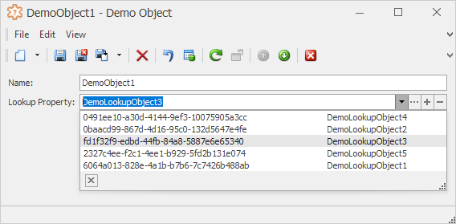

<!-- default badges list -->

<!-- default badges end -->

# XAF WinForms - How to use a custom Lookup Property Editor control for reference properties

> **Note**  
> The description of this example is currently under construction and may not match the code in the example. We are currently working to provide you with up-to-date content.

## Scenario

This example demonstrates a simple drop-down editor for reference properties. The editor provides the **Open**, **Add** and **Clear** buttons.

## Implementation Details

1. The _Editors.Win_ module implements a reusable `LookupPropertyEditorEx` class. This is an XAF Property Editor that can be used for reference properties instead of the standard `LookupPropertyEditor` in WinForms XAF applications.

2. The `LookUpEditEx` and `RepositoryItemLookUpEditEx` classes implement a control for this Property Editor. This control is inherited from the `LookUpEdit` class and extends it with additional features required for the Property Editor.

## Additional Information

1. From this example, you need use only one assembly (the _WinSolution_ from the example is just a demo application, and it has no relation to the solution): `Editors.Win.dll`.
   
   Since this is a regular XAF module, you should add this module to your application to be able to use its features. In case of standard modules, you add them from the Toolbox via the Application or Module designer. Since we deal with a custom module, you should add this into the Toolbox manually. For additional information, refer to the following article: [To add a tool to the toolbox](https://learn.microsoft.com/en-us/visualstudio/modeling/customizing-tools-and-the-toolbox?view=vs-2022#to-add-a-tool-to-the-toolbox).
   
   Alternatively, you can take the source code and include it in your solution.

2. The `LookupPropertyEditorEx` is set as default for all lookup properties in the application.
   
   If you want to change this, then invoke the Model Editor for the Windows Forms application project or module, and change the **EditorType** property of the **DetailViewItems** | **PropertyEditors** | **LookupProperty** node. Or change the **PropertyEditorType** property for a class member, List View column or Detail View item nodes individually.

## Files to Review (XPO)
* [LookupPropertyEditorEx.cs](./CS/XPO/Editors.Win/LookupPropertyEditorEx.cs) (VB: [LookupPropertyEditorEx.vb](./VB/Editors.Win/LookupPropertyEditorEx.vb))
* [LookUpEditEx.cs](./CS/XPO/Editors.Win/LookUpEditEx.cs) (VB: [LookUpEditEx.vb](./VB/Editors.Win/LookUpEditEx.vb))
* [RepositoryItemLookUpEditEx.cs](./CS/XPO/Editors.Win/RepositoryItemLookUpEditEx.cs) (VB: [RepositoryItemLookUpEditEx.vb](./VB/Editors.Win/RepositoryItemLookUpEditEx.vb))

## Files to Review (EF Core)
* [LookupPropertyEditorEx.cs](./CS/EFCore/Editors.Win/LookupPropertyEditorEx.cs)
* [LookUpEditEx.cs](./CS/EFCore/Editors.Win/LookUpEditEx.cs)
* [RepositoryItemLookUpEditEx.cs](./CS/EFCore/Editors.Win/RepositoryItemLookUpEditEx.cs)

## Documentation

* [Implement Custom Property Editors](https://documentation.devexpress.com/eXpressAppFramework/113097/Concepts/UI-Construction/View-Items/Implement-Custom-Property-Editors)
* [PropertyEditors.Lookup - How to provide alternative data representations for reference lookup properties (e.g., a simple drop-down box, a complex multi-column grid, or a tree view)](https://www.devexpress.com/Support/Center/Question/Details/S92425/propertyeditors-lookup-how-to-provide-alternative-data-representations-for-reference)

