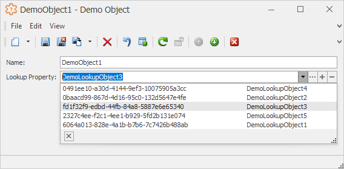

<!-- default badges list -->

<!-- default badges end -->

# XAF WinForms - How to use a custom Lookup Property Editor control for reference properties

This example demonstrates a simple drop-down editor for reference properties. The editor contains **Open**, **Add** and **Clear** buttons.

## Implementation Details

The [LookupPropertyEditorEx.cs](./CS/EFCore/Editors.Win/LookupPropertyEditorEx.cs) file contains the reusable `LookupPropertyEditorEx` class. This Property Editor can be used for reference properties instead of the standard `LookupPropertyEditor` in WinForms XAF applications.

The `LookUpEditEx` and `RepositoryItemLookUpEditEx` classes implement a control for this Property Editor. The control extends the  [LookUpEdit](https://docs.devexpress.com/WindowsForms/DevExpress.XtraEditors.LookUpEdit) class with additional features.

> **Note**  
> To further research how the lookup property editor works, you can look at its source code in the following file:  
> _C:\Program Files\DevExpress xx.x\Components\Sources\DevExpress.ExpressApp\DevExpress.ExpressApp.Win\Editors\LookupPropertyEditor.cs_

## Files to Review (EF Core)
* [LookupPropertyEditorEx.cs](./CS/EFCore/Editors.Win/LookupPropertyEditorEx.cs)
* [LookUpEditEx.cs](./CS/EFCore/Editors.Win/LookUpEditEx.cs)
* [RepositoryItemLookUpEditEx.cs](./CS/EFCore/Editors.Win/RepositoryItemLookUpEditEx.cs)

## Files to Review (XPO)
* [LookupPropertyEditorEx.cs](./CS/XPO/Editors.Win/LookupPropertyEditorEx.cs) 
* [LookUpEditEx.cs](./CS/XPO/Editors.Win/LookUpEditEx.cs) 
* [RepositoryItemLookUpEditEx.cs](./CS/XPO/Editors.Win/RepositoryItemLookUpEditEx.cs) 

## Documentation

* [Implement Custom Property Editors](https://documentation.devexpress.com/eXpressAppFramework/113097/Concepts/UI-Construction/View-Items/Implement-Custom-Property-Editors)
* [Custom Dropdown Editors with Popup Forms](https://docs.devexpress.com/WindowsForms/4716/controls-and-libraries/editors-and-simple-controls/common-editor-features-and-concepts/custom-editors#custom-dropdown-editors-with-popup-forms)
* [IComplexViewItem Interface](https://docs.devexpress.com/eXpressAppFramework/DevExpress.ExpressApp.Editors.IComplexViewItem)
* [IGridInplaceEdit Interface](https://docs.devexpress.com/eXpressAppFramework/DevExpress.ExpressApp.Win.Core.IGridInplaceEdit)
* [LookUpEdit Class](https://docs.devexpress.com/WindowsForms/DevExpress.XtraEditors.LookUpEdit)
* [PropertyEditorAttribute Class](https://docs.devexpress.com/eXpressAppFramework/DevExpress.ExpressApp.Editors.PropertyEditorAttribute)
* [RepositoryItemPopupContainerEdit Class](https://docs.devexpress.com/WindowsForms/DevExpress.XtraEditors.Repository.RepositoryItemPopupContainerEdit)

<!-- feedback -->
## Does this example address your development requirements/objectives?

 

(you will be redirected to DevExpress.com to submit your response)
<!-- feedback end -->
